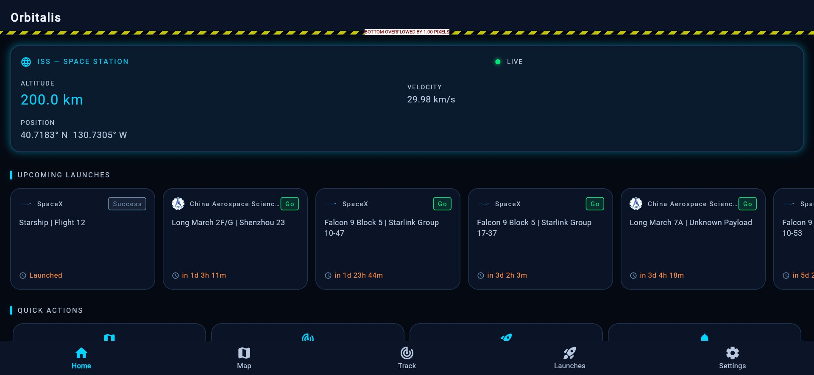
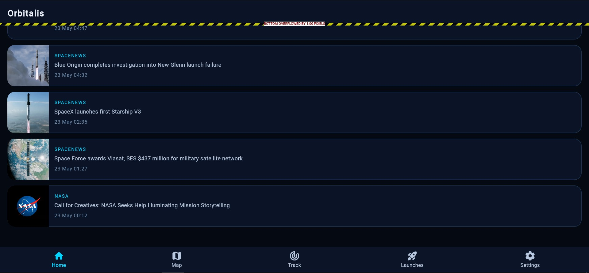
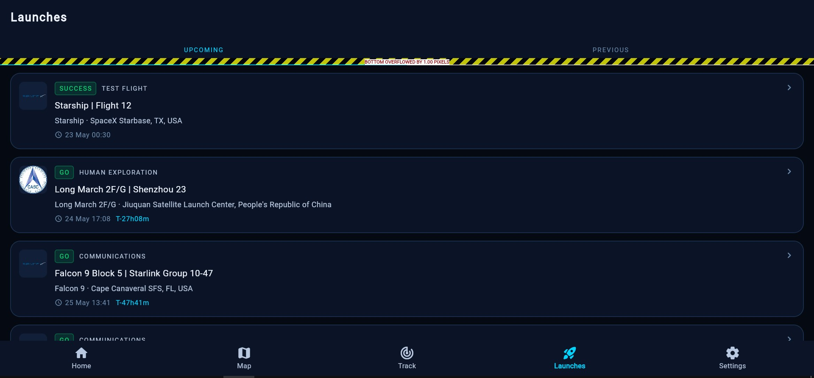
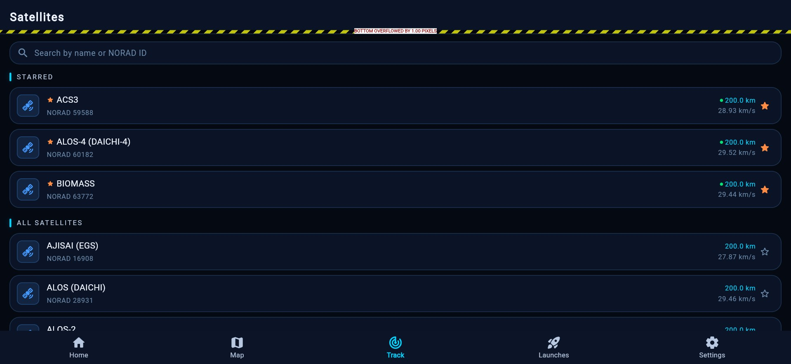
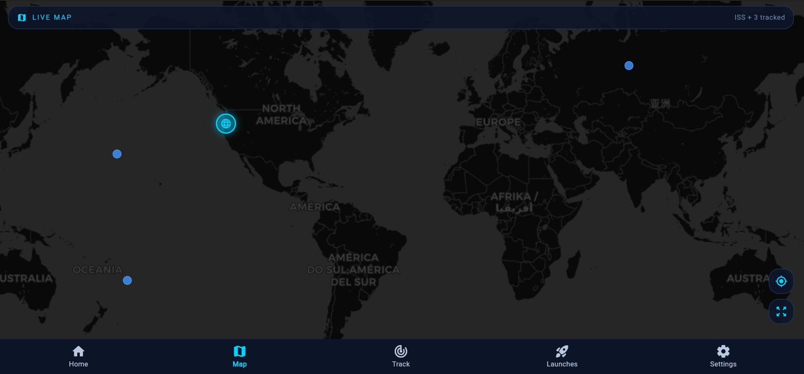

# Orbitalis

A Flutter application that lets users track satellites and space stations in real time. Search for and mark the space objects you wish to keep an eye on. Whenever such objects pass over the users's location, notifications are sent to inform them. News related to space agencies and launch countdowns are also displayed for those interested in the most up to date informations.

## Development

This project has been created as part of the *Mobile Applications and IoT devices Programming* course at the *University of Miskolc*. All of the source code has been generated by AI to investigate how well such a system may be integrated into the development of a complex application. Several advantages and disavantages can be noted when using this sort of development cycle.

### Advantages

- **Quick prototyping**: Deciding on the general concept is easy, but refining it to the level of implementation is much more time consuming. This can be aided by AI to create a concrete specification of the project.

- **Fast coding**: Naturally, AI is very good at generating a large amount of code. Due to the ample number of Flutter applications available online as references, the generated code also conforms to the average standard of these kind of projects.

- **Minimal knowledge required**: Even without having advanced technical knowledge about the Dart programming language or the Flutter framework, one may use AI to create an entire application from scratch. This can be  remotely compared to *no code* development environments, supposing that the users do not directly interacti with the generated code. For development of this kind, the only realistic skills required would be in the realms of natural language, and the ability to word sentences correctly and coherently.

- **Access to online resources**: Following the prototyping phase, the AI would construct a specification to use for implementing business logic. Tools, libraries and APIs available online for free may lie outside the scope of the user's knowledge. In this case, the AI takes care of choosing sufficient technologies to implement all required logic.

### Disadvantages

- **Expensive**: The more powerful AI we use, the more expensive it will be. For large and complex projects, this might scale so badly that it is not worth considering the usage of AI. After a developer exhausts all his tokens, he might have to wait a significant amount of time, thus hindering development.

- **Prone to misunderstanding**: Large language models are quite advanced, but the more complex a task is the harder it is for the AI to formulate a correct answer. Partitioning the problem into smaller subdivisions may help, however the overall context of the problem may be lost and this would reflect in the solution as well. As the codebase and application complexity grow, it becomes increasingly difficult to steer the AI in the desired direction.

- **Difficult to modify**: Whenever a problem manifests, two things can happen. If the code is well structured, the problem may only be localized and the AI will find it in a moderate amount of time and fix it. However, if the issue spans beyond a local mistake, then finding it is extremely difficult as it is likely context dependent, and so, many parts of the code may influence how it manifests.

- **Bloated code**: Most code available online varies in both the complexity of the problem and the complexity of the code that solves it. As the AI models have learned from both good and bad solutions, their own answers are an average of all these methods of solution. This may result in generating code that is overly complicated or ignores resource requirements (time and space complexity), impacting preformance.

- **Dead end for lesser skilled users**: If a problem occurs that seemingly cannot be fixed by prompting the AI, the advantage of *no code* becomes its curse. A user who does not understand code can develop applications with the help of AI, however when such an "unfixable" problem presents itself, the user is stuck. A skilled developer may be able to parse the code themselves manually and find the issue and ultimately fix it, however even this might take a significant amount of time, futher hindering development. Users without knowledge of programming have no chance to resolve these types of problems.

---

The development cycle employed 3 different AIs: **ChatGPT**, **Gemini**, and **Claude**.
1. ChatGPT was used to provide the initial concept and outline for the project specification.

> **ChaptGPT**
> 
> I want to create a flutter application. To do so, I am using claude code to generate code. Your task is to create a prompt that specifies every necessary detail of the application so code generation can proceed smoothly. First, help me choose the type of application. It should not be a basic tic tac toe or calculator, but an entire application with a nice UI, datasources and so on. This is not a production application, but rather a showcase of flutter's capabilities. I want something that is both complex enough, but also interesting to use.

After the initial concept has been established, it needed some further extensions to make the application usable.

> **ChatGPT**
> 
> I like the idea of an application that tracks space objects, like space stations, satellites, and events such as rocket launches. Other than providing visualizations, the app could allow users to receive updates from selected objects and schedule when they pass over certain locations, including the user's current location.

When all the features and requirements have been agreed on, I prompted the AI to create a detailed specification for *Claude* to use for code generation.

> **ChatGPT**
>
> please generate a very detailed, structured prompt for claude code that describes the project specifications

This resulted in ChatGPT producing a \~1000 line text document `specs.txt` outlining the key aspects of the project along with implementation specific details such as what Flutter packages and libraries to use and also what APIs are available for gathering satellite informations.

2. I supplied the generated `specs.txt` to *Gemini* for refinement and optimizing for Claud's usage.

> **Gemini**
> 
> *attached specs.txt*\
> This is a prompt for claude code to generate a flutter application that tracks satellites and is feature rich. Please help me refine this prompt to fully specify every detail so code generation can proceed smoothly. Modify this specification such that real data from free sources such as celestrak are included.

It generated a much less verbose \~100 line document `specs2.txt`, which had many of the implementation related information missing. This shortening was against my intentions so I wrote 2 more prompts explaining the issues. This pattern of leaving out important information continued, despite it being told not to. After multiple attempts, I gave up and went back to ChatGPT to merge the conciseness of the shortened document and the detailed nature of the verbose document.

> **ChatGPT**
> 
> *attached specs2.txt*\
> Optimize your prompt to align with claude's model, strict and explicit specification. Use the specs2.txt as an example.

The result was a more refined \~700 lines of specification containig implementation details, project structure, APIs to use, user features and so on. Along with these, explicit steps were specified partition the code generation of Claude into phases so that it does not try to generate the whole project at once.

3. Using Claude's most powerful model Opus 4.7, I once more asked the AI to generate a specification, now the final one such that it is optimized to its own capabilities. After this step, I switched over to a less powerful model, Sonet 4.6, so that its token consumption would be minimized, while still performing decent work.

(*The initial prompts were lost due to context compression; the one listed below is the earliest prompt after the skeleton project and minimal business logic has been generated.*)

> **Claude**
> 
> *attached specs_final.txt*\
> Continue building the Orbitalis Flutter app by replacing all placeholder screens (TrackingScreen, SatelliteDetailScreen, MapScreen, LaunchesScreen, LaunchDetailScreen, NotificationsScreen, SettingsScreen) with full implementations, then run build_runner and get a clean analyze.

The generation of the entire project with minor alterations afterwards took around 2-3 hours and used 60% of available tokens. The final application was not up to standard. There were several issues, out of which the most severe was the abismal performance. I tried to convey these to Claude:

> **Claude**
> 
> There are a number of issues with the app. After the flutter run command, it takes 40+ seconds for the application to start on windows 10 using chrome. Initialization takes a further 30+ seconds. Scrolling, animations, and moving around feels noticeably laggy. Real time ISS data does not load, but only after a significantly long time (minutes). Tracking data loads extremely slowly. Clicking on the map freezes the application completely and takes an embarrassingly long time to load and it displays an incoherent number of objects, which makes it impossible to discern any useful information. The back arrows of different tabs do not work at all. Marking a satellite with star does not do anything besides updating the widget; a functionality of listing followed satellites and other visible indicators should be added. Renderflex: 1 pixel at bottom overflow, GoError: nothing to pop, exceptions occur. flutter_map says: Consider installing the official 'flutter_map_cancellable_tile_provider' plugin for improved performance on the web. The contrast between the general color theme and fonts is too little and hard to differentiate. Make modifications to address these problems. Optimize the application and API fetches. Do not try to render anything in real time, always have a 10, 15, 30 second delay for critical data and a few minutes or hours of delay for other types of data. These delays hinder usability so it is paramount to eliminate or at least decrease them.

After some time, it appeared to have remedied the issues described, but at closer inspection, some critical problems remained prevelant. So I pinpointed these exact problems and suggested some solutions.

> **Claude**
>
> Application startup time still feels slow, but better than before (now around 10-15 seconds). Only 1 satellite can be selected, ISS Zarya in the tracker page, which is not very useful. Display more satellites to choose, on the map only visualize those that have been starred (marked for tracking). To not hinder performance find a solution that is optimal for both user content and performance, do not fetch all satellite data at once, it could be in large chunks. Satellite information displayed in the tracking page could be updated several minutes apart, while those that are marked as tracked could be updated quicker, like every 10, 15, 30 seconds. This way a large selection is maintained, performance remains relativley good and the map can function as well. 

The most pressing issues have resolved aferwards, however smaller problems still persisted and this kind of conversation of pointing them out and then Claude generating some sort of fix, continued for about 1-2 hours. The last remaining obstacles were relatively poor performance and a graphical error, where the text contents of a box overflowed by 1 pixel. Neither of these could be fixed, no matter how many times I asked, how many solutions or aternatives I suggested, it just kept on generating code and claiming to have fixed the issues, while in reality all remained the same. The current state of the project is the result of these final fixes and generations.

## Conclusion

The first few steps of the development cycle were easy and kind of enjoyable, being more akin to the role of a manager. However, as time went on and the project grew, it became exponentially harder to command the AI. Some changes I requested never materialized, while features I have never specified were being implemented. At the later stages, it became a struggle to control the AI as my promts had seemingly no real effect on the codebase anymore. My frustrations only increased from then on and I decided to settle for what it had produced so far. There are still some series problems with the application, however for an entirely AI generated piece of codebase it functions relatively well. It has some handy features, such as displaying real time ISS data and satellite positions with notificaitons when a marked objecet passes by the location of the user. A map that indicates the current positions of these objects, launch schedules and a space news feed are also available. Personally, I believe that, as with many other things, AI is a tool and how well it is utalized depends entirely on its user. For competent developers, it automates menial tasks; and for those lacking, provides the illusion of skill.

*(No AI has been used in the composition of this text.)*

## Images

**Orbitalis homepage**

**Space related news section**

**Rocket launches and live streams**

**Satellites available for tracking**

**Map displaying all tracked satellites and the ISS**

